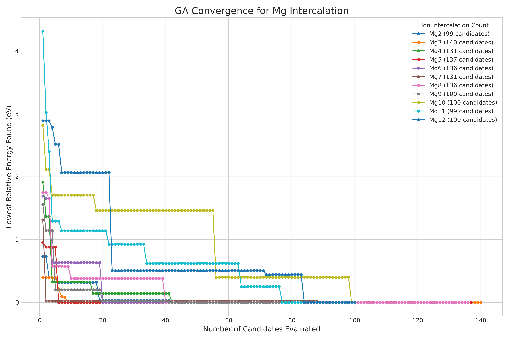

## Description of Scripts

----------
### `clean_kids_from_db.py`

**DESTRUCTIVE**: This action will permanently delete candidates.

Deletes all descendents of the initial population to start the GA from scratch.
Go to the `Mg-$i` directory and run `python ../clean_kids_from_db.py`

### `extract_ga_energy`

Creates a CSV file of energies for each ion, from which a Convex Hull can be constructed.

Some information, like ion name and reference energies, needs to be modified inside this script.

Run this script here (`./extract_ga_energy`) , and then run `python plot_convex_hull.py`

### `initialize_db.py`

Part of the core workflow.

If you don't like how it initializes the candidates (randomly), then create your own script.

### `main_run.py`

Part of the core workflow.

### `monitor_ga.py`

Creates a plot to monitor convernge of GA. It looks something like this:

### `plot_convex_hull.py`

Pretty self explanatory.

### `slurmqueuerun.py`

Part of the core workflow.
